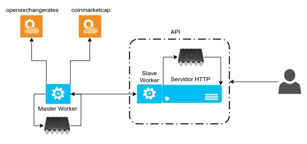

# Challenge Bravo

Este projeto é a solução do desafio explicado em [CHALLENGE.md](CHALLENGE.md)

Ele foi desenvolvido em [Go](https://golang.org/) com framework [echo](https://echo.labstack.com/) para HTTP

## Arquitetura

Foram implementadas 2 arquiteturas:

- Com [nginx](https://www.nginx.com/)


- Sem [nginx](https://www.nginx.com/)

 
 Após adicionar nginx na frente da API para caching foi percebido uma perda de performance. Portanto, a arquitetura recomendada é a sem nginx.

 ### Componentes da arquitura

 #### API

A API é um servidor HTTP contendo a rota `/convert` para conversão de moedas.

Para garantir uma resposta rápida, o servidor não faz nenhum acesso a recursos externos no tempo de um request, para evitar um possível gargalo de rede ou até do provedor do recurso externo (redis/memcached ou outra API). Ela possui as cotações das moedas (com relação a moeda lastro USD) em uma estrutura de dados in-memory sendo atualizada pelo Slave Worker. Portanto, em um request o servidor apenas consulta a RAM para fazer o cálculo da conversão e entregar uma resposta rápida.

Exemplo de request à API:

GET /convert?from=BTC&to=USD&amount=1

Resposta:
```
{
    "from": "BTC",
    "to": "USD",
    "amount": 1,
    "result": 6981.319336849224
}
```

#### Slave Worker

O Slave Worker é uma goroutine que roda dentro do servidor para atualizar as cotações do servidor. Ele consulta uma API do Master Worker para atualizar o estado do servidor.

#### Master Worker

O Master Worker consome 2 APIs de cotações ([openexchangerates](https://openexchangerates.org) e [coinmarketcap](https://api.coinmarketcap.com/)). Ele atualiza suas cotações em uma estrutura de dados in-memory e prover uma rota HTTP (`/prices`) para servir essas cotações ao Slave Worker.

Exemplo de request:

GET /prices

Resposta:
```
{
    "BRL": 4.15725,
    "BTC": 0.000135659526,
    "ETH": 0.003514403291365063,
    "EUR": 0.862571,
    "USD": 1
}
```