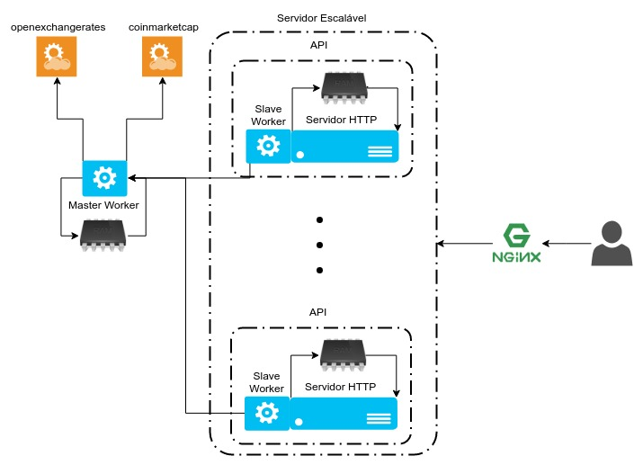
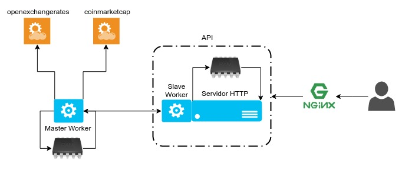

# Challenge Bravo

Este projeto é a solução do desafio explicado em [CHALLENGE.md](CHALLENGE.md)

Ele foi desenvolvido em [Go](https://golang.org/) com framework [echo](https://echo.labstack.com/) para HTTP

## Pré-requisitos

Você precisará de uma API Key da [openexchangerates](https://openexchangerates.org) para rodar. (No PR foi enviada uma para ser utilizada)

Você pode rodar a aplicação em containers docker ou sem containers buildando o projeto a partir do source.

### Com docker

Você precisa ter instalado:

- [Docker](https://www.docker.com/) versão 18.x
- [Docker Compose](https://docs.docker.com/compose/) versão 1.22+

### Sem docker

Você precisa ter instalado:

- [Go](https://golang.org/) v1.11

## Instalando e Rodando

Você precisará de setar uma variável de ambiente (`OXRAPIKEY`) ou, caso rodando em docker, criar arquivos de .env para passar a API Key.

Por padrão, serão usadas as configurações do ambiente `dev`, para você mudar, basta setar a variável `GOCONFIGPATH` para o caminho do json de configurações (dentro da pasta `config`).

Uma observação é que com o Go v1.11 as dependências do projeto (descritas em go.mod) serão baixadas e instaladas no momento do build.

### Com docker

Crie um arquivo na raiz do projeto com o nome `.env_masterworker`, e coloque nele a API Key da openexchangerates como no exemplo:

```
OXRAPIKEY=<aqui vai a API Key, sem os "<>">
```

Para buildar, levantar toda a infra e rodar:

```
$ sudo docker-compose up -d
```

Para descer o servidor:

```
$ sudo docker-compose down
```

### Sem docker

Caso tenha baixado o projeto dentro da sua `GOPATH`, antes de buildar, sete a variável de ambiente do Go 1.11:
```
$ export GO111MODULE=on
```

Para buildar o Master Worker:
```
$ go build -mod=vendor -o masterworker cmd/masterworker/main.go
```

Para buildar a API:
```
$ go build -mod=vendor -o server cmd/api/main.go
```

O Master Worker deve ser levantado primeiro, depois a API.

Para subir o Master Worker você precisará setar as variáveis de ambiente `OXRAPIKEY` e `GOCONFIGPATH` primeiro.

Então, basta rodar os binários já buildados:
```
$ export OXRAPIKEY=<sua API Key da openexchangerates>
$ export GOCONFIGPATH=config/config.dev.json
$ ./masterworker
```
Em outro terminal, sete a variável `GOCONFIGPATH` e rode a API:
```
$ export GOCONFIGPATH=config/config.dev.json
$ ./server
```

## Arquitetura

O projeto suporta 3 arquiteturas:

1. Com [nginx](https://www.nginx.com/) como load balancer



2. Com [nginx](https://www.nginx.com/) para caching



3. Sem [nginx](https://www.nginx.com/)


 
A implementação atual é escalável, mas não tem configurações feitas para auto-escalar ou subir múltiplos nós de API. Então, a arquitetura 2 tem um nginx na frente da API apenas para caching, não como load balancer.

No entanto, foi percebida uma perda de performance da mudança da arquitetura 3 (sem nginx) para a 2. Portanto, a arquitetura recomendada para rodar aplicação agora é a sem nginx. (Os benchmarks mostrados aqui foram feitos nela)

 ### Componentes da arquitura

 #### API

A API é um servidor HTTP contendo a rota `/convert` para conversão de moedas.

Para garantir uma resposta rápida, o servidor não faz nenhum acesso a recursos externos no tempo de um request, para evitar um possível gargalo de rede ou até do provedor do recurso externo (redis/memcached ou outra API). Ela possui as cotações das moedas (com relação a moeda lastro USD) em uma estrutura de dados in-memory sendo atualizada pelo Slave Worker. Portanto, em um request o servidor apenas consulta a RAM para fazer o cálculo da conversão e entregar uma resposta rápida.

Exemplo de request à API:

GET /convert?from=BTC&to=USD&amount=1

Resposta:
```
{
    "from": "BTC",
    "to": "USD",
    "amount": 1,
    "result": 6981.319336849224
}
```

#### Slave Worker

O Slave Worker é uma goroutine que roda dentro do servidor para atualizar as cotações do servidor. Ele consulta uma API do Master Worker para atualizar o estado do servidor.

#### Master Worker

O Master Worker consome 2 APIs de cotações ([openexchangerates](https://openexchangerates.org) e [coinmarketcap](https://api.coinmarketcap.com/)). Ele atualiza suas cotações em uma estrutura de dados in-memory e prover uma rota HTTP (`/prices`) para servir essas cotações ao Slave Worker.

Exemplo de request:

GET /prices

Resposta:
```
{
    "BRL": 4.15725,
    "BTC": 0.000135659526,
    "ETH": 0.003514403291365063,
    "EUR": 0.862571,
    "USD": 1
}
```